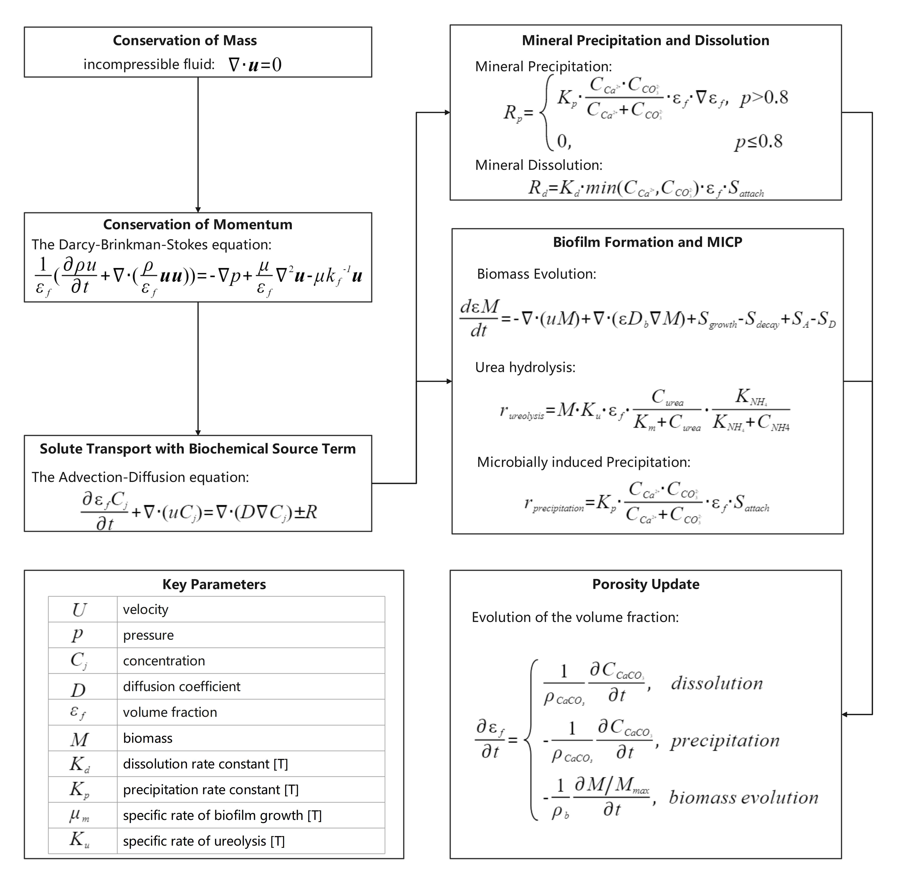
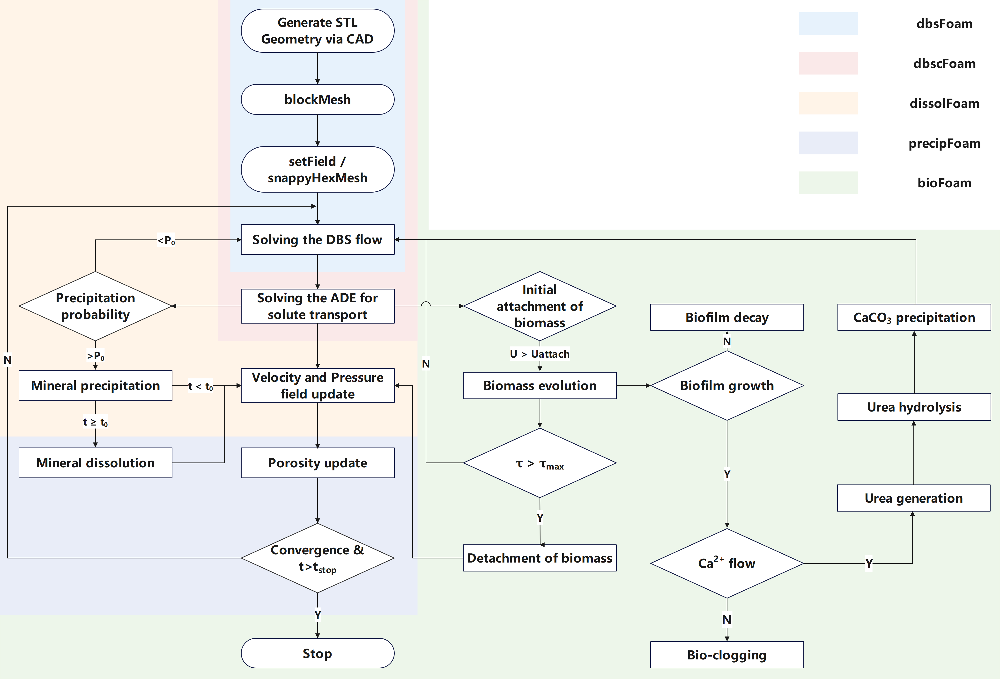

# porousRTFoam
**porousRTFoam** is an open-source software designed to simulate hydro-bio-geochemical processes in porous media using the CFD platform OpenFOAM®. It leverages all OpenFOAM® functionalities, allowing the finite-volume solution of the Darcy-Brinkman-Stokes equation alongside other partial differential equations, with support for parallel computing. 



### 1. Structure of porousRTFoam
1. **solvers**:

porousRTFoam includes the following solvers: ```dbsFoam```, ```dbscFoam```, ```dissolFoam```, ```precipFoam```, and ```bioFoam```. 

2. **cases**: 

Four test cases are provided, located in the following folders: ```Flow_Solute_Transport```, ```Reactive_Transport```, ```Biofilm```, and ```MICP```.

### 2. Installation
The solvers were developed on OpenFOAM v7. Ensure OpenFOAM v7 is installed before proceeding. If multiple OpenFOAM versions are present, source the v7 environment with:

```source /path/to/openfoamv7/etc/bashrc```

To install the solvers, navigate to each ```folder``` in solvers and run:

```wmake```

Please note that additional libraries, not included in the standard OpenFOAM installation, are required.

